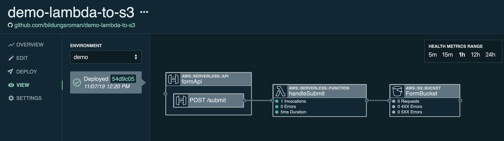
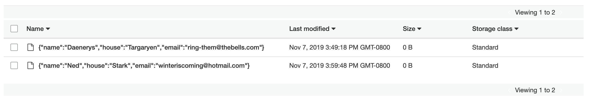

# Lambda to S3 demo in NodeJS10.x

This application takes the event body from an API `POST` event and writes it to an S3 bucket.

A sample `event.json` is included for running `stackery local invoke`.

The stack:



When the function is invoked, the data from the event is written to the S3 bucket:



## Deploying the app

To deploy with [Stackery](https://www.stackery.io/):

1. Clone this repo
2. `cd` to the root of the repo and run
```bash
stackery deploy --interactive setup
```
3. View your app in the [Stackery Dashboard](https://app.stackery.io/) once it's deployed

Here is an overview of the files:

```bash
.
├── README.md                     <-- This README file
├── src                           <-- Source code dir for all AWS Lambda functions
│   ├── handleSubmit                  <-- Source code dir for getItems function
│   │   ├── README.md             <-- Function-specific README
│   │   ├── index.js              <-- Lambda function code
│   │   ├── package.json          <-- NodeJS dependencies
│   │   └── .stackery-config.yaml <-- Stackery function configuration file
└── template.yaml                 <-- SAM infrastructure-as-code template
└──.stackery-config.yaml          <-- Stackery stack configuration file
```

